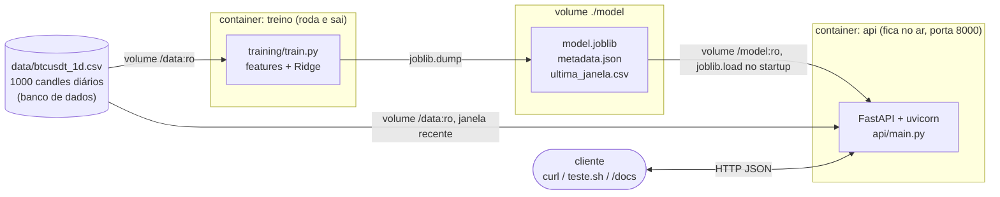
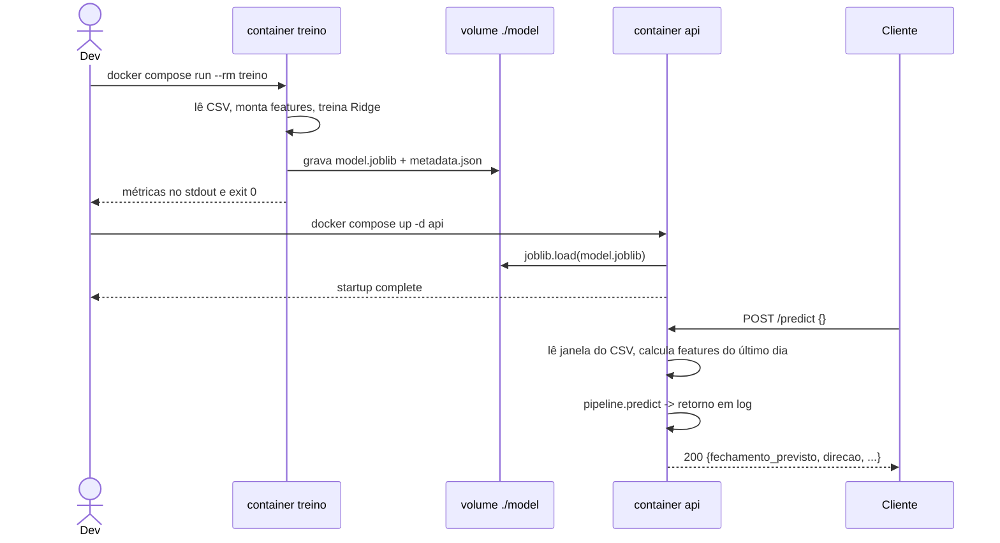

# Ponderada EC07 - previsão de preço do BTC com Docker

A Atividade a seguir foi realizada por **Felipe Caiafa Alvim Soares**

## Arquitetura (A arquitetura foi gerada em uma conversa entre eu e o Claude, além disso todo o codigo mermaid também foi gerado por IA)

Diagrama de componentes:



Os dois containers nunca se falam direto. O que liga um ao outro é a pasta
`./model`, montada como volume nos dois: o treino escreve ali, a API lê dali.
Foi assim que resolvi a parte de "como o modelo treinado chega no container de
inferência".

Fluxo de uma predição:



**O que eu entendi daqui:** o desenho foi decisão minha (dois containers que não se falam por rede, só por um volume com o artefato. O código mermaid foi a IA que escreveu a partir do que eu descrevi na conversa. Entendi que ela só traduziu a minha descrição em caixinhas e setas, e consigo ler o diagrama e dizer o que cada seta é na prática. A sintaxe do mermaid em si eu não escreveria de cabeça (e imagino que niguém espera isso também), fui pedindo para a IA até o desenho ficar igual ao que eu tinha imaginado antes, ja que a IA acrescentou coisas.

## Estrutura

```
.
├── data/btcusdt_1d.csv     banco de dados (CSV com 1000 candles diários)
├── model/                  artefato gerado pelo treino
├── shared/features.py      engenharia de features (usada pelos dois containers)
├── training/
│   ├── train.py            treino + avaliação + export
│   ├── fetch_data.py       script que baixou o CSV da Binance
│   ├── requirements.txt
│   └── Dockerfile
├── api/
│   ├── main.py             FastAPI, carrega o artefato e responde predições
│   ├── requirements.txt
│   └── Dockerfile
├── teste.sh                teste de ponta a ponta nos endpoints
└── docker-compose.yml
```

 **Minha leitura dessa parte:** a árvore é só o que existe nas pastas, nada de misterioso aqui. A única coisa que eu não tinha entendido no começo foi o por que o features precisava ficar num shared/ fora de training/ e de api/, em vez de eu copiar o arquivo nas duas pastas. Entendi depois, quando começou a dar erro e o claude começou a me ajudar, mas mesmo assim ainda não entendi muito bem essa parte 

## Como rodar

Para rodarmos oo projeto s precisamos de Docker e Docker Compose. O CSV e o modelo treinado já estão no repo,
então pra só ver funcionando dá pra pular o treino.

```bash
# 1. treinar (grava o artefato em ./model)
docker compose run --rm treino

# 2. subir a API
docker compose up -d api

# 3. conferir se está no ar
curl -s localhost:8000/health

# 4. pedir uma predição
curl -s -X POST localhost:8000/predict -H 'Content-Type: application/json' -d '{}'

# 5. rodar o roteiro de testes
bash teste.sh

# derrubar
docker compose down
```

Se o seu usuário não for uid 1000, o treino escreve o artefato como outro dono.
Nesse caso:

```bash
docker compose run --rm --user "$(id -u):$(id -g)" treino
```

Pra atualizar o CSV com dados novos (precisa de internet):

```bash
python training/fetch_data.py --symbol BTCUSDT --interval 1d --limit 1000
```

## Endpoints

| Método | Rota | O que faz |
|---|---|---|
| GET | `/health` | diz se o processo está no ar e se o modelo carregou |
| GET | `/model/info` | metadados do artefato: métricas, janelas, features, coeficientes |
| POST | `/model/reload` | recarrega o artefato do volume sem reiniciar o container |
| POST | `/predict` | previsão do fechamento do dia seguinte |
| GET | `/docs` | Swagger gerado pelo FastAPI |

`POST /predict` aceita corpo vazio (`{}`), e aí usa a janela mais recente do CSV
montado no container. Se eu mandar `{"candles": [...]}` com pelo menos 22 candles
diários, ele usa esses em vez do CSV:

```bash
curl -s -X POST localhost:8000/predict \
  -H 'Content-Type: application/json' \
  -d '{"candles":[{"date":"2026-06-01","open":...,"high":...,"low":...,"close":...,"volume":...}, ...]}'
```

Resposta:

```json
{
  "par": "BTCUSDT",
  "data_referencia": "2026-10-04",
  "fechamento_referencia": 86530.0,
  "data_prevista": "2026-10-05",
  "fechamento_previsto": 86530.53,
  "variacao_prevista_pct": 0.0006,
  "direcao": "estavel",
  "versao_modelo": "1.0.0",
  "origem_dados": "csv:/data/btcusdt_1d.csv"
}
```

**O que eu entendi daqui:** as rotas e o que cada uma devolve, isso sim fui eu que pedi para IA testar uma por uma com curl. O que é código de IA e eu entendi mais ou menos.


## O modelo

- Dados: 1000 candles diários de BTCUSDT da API pública de klines da Binance
  (2024-01-10 até 2026-10-04), salvos em CSV.
- Alvo: `log(close[t+1] / close[t])`, o retorno em log do dia seguinte. Previ
  retorno e não preço porque o preço do BTC vai de 40k a 120k dentro da base, e
  modelo linear treinado direto no preço só aprende a repetir o último valor.
- Features (10): retornos defasados de 1, 2, 3, 5 e 10 dias, desvio do preço em
  relação às médias móveis de 7 e 21 dias, volatilidade de 7 dias, desvio do
  volume em relação à média de 7 dias e amplitude relativa do candle.
- Modelo: `StandardScaler` + `Ridge`. O alpha é escolhido na janela de validação.
- Split cronológico, sem shuffle: 678 dias de treino, 150 de validação, 150 de
  teste. Depois de escolher o alpha, retreino com treino + validação (828 dias) e
  mede no teste.

Resultado no teste (2026-05-07 a 2026-10-03, 150 dias):

| | MAE (USD) | RMSE (USD) | MAPE | Acerto de direção |
|---|---|---|---|---|
| Ridge (alpha=1.0) | 1002.92 | 1454.79 | 1.417% | 48.7% |
| Baseline "amanhã fecha igual hoje" | 981.84 | 1429.29 | 1.385% | - |

O modelo perde da baseline por 2.15% de MAE. Comento isso em limitações.

**O que eu entendi daqui:** Essa é a parte que a IA mais fez do projeto. O que eu entendi de verdade: prever retorno em log em vez de preço isso foi a explicação da IA para o meu entendimento, que todas as features olham apenas pra trás, e que o split ser cronológico é o que evita o treino ver o futuro. Das 10 features eu entendi mais ou menos a maioria.

## Devlog ( Esse Devlog foi revisado e refeito por mim, porém inicialmente foi feito pela IA com base no que eu escrevi no "O que eu endendi daqui de cada parte acima.)

### o desenho

Antes de escrever código eu decidi como ia ser: dois containers que não se falam por
rede, só por um volume com o artefato. O treino escreve ali, a API lê dali. Essa
parte foi minha. Os diagramas lá em cima a IA escreveu a partir do que eu descrevi, e
fui pedindo pra refazer até ficar igual ao que eu tinha na cabeça.

### docker, compose e os erros

O Docker, o compose e a amarração entre os containers eu fiz na mão. Foi aí que apareceram problemas que me travaram.Na primeira execução já tinha dado erro então usei o Claude e a correção foi setar PYTHONPATH no Dockerfile. A explicação que recebi é que o Python coloca a pasta do script no caminho de busca, não a raiz do projeto, e o módulo compartilhado está na raiz. É a mesma dúvida que eu já tinha de por que esse módulo não fica copiado dentro das duas pastas. Resolveu, mas essa parte eu ainda não entendi muito bem.


### treino e features

Esse código foi gerado com IA. Do que ela escreveu, o que eu entendi:

- o alvo é o retorno em log do dia seguinte, não o preço. A explicação foi que o BTC
  vai de 40k a 120k dentro da base, e modelo linear treinado em cima do preço só
  aprende a repetir o último valor.
- todas as features olham só pra trás, nunca pra frente.
- o split é cronológico, e é isso que evita o treino ver o futuro.

São 10 features e eu entendi mais ou menos todas elas

Outra coisa que a IA apontou e eu não tinha visto é que o último candle que vem da Binance é o do dia de hoje, que ainda está aberto, então o fechamento dele não é fechamento de nada. Tem uma função que descarta esse candle, e o treino roda com 999 linhas em vez de 1000.

### o modelo perde da baseline

Rodando o treino, o modelo erra mais que simplesmente chutar "amanhã fecha igual
hoje". Testei alpha de 1 até 3000:

| alpha | MAE teste | diferença vs baseline |
|---|---|---|
| 1 | 1002.92 | -2.15% |
| 10 | 1000.41 | -1.89% |
| 100 | 992.39 | -1.07% |
| 1000 | 986.64 | -0.49% |
| 3000 | 986.10 | -0.43% |

Nenhum valor ganha da baseline, e quanto mais alto o alpha mais a predição vira variação zero, que é a própria baseline.

A IA apontou que escolher o alpha olhando o resultado do teste é olhar o gabarito, e o split passou a ter três janelas: treino, validação e teste. O alpha sai da validação e o teste é medido uma vez. Saiu 1.0, que é justamente o pior da tabela. Deixei esse número em vez de trocar por um mais bonito.

A baseline não tem acerto de direção porque ela prevê variação zero, e aí a conta dá 0% sempre, o que não é resultado de nada.

### API

O código da API também é de IA. O que eu fiz foi pedir pra ela testar as rotas.

### testes

O script de ponta a ponta roda 6 checagens e todas passam: health, metadados, prediçao pelo CSV, predição com candles mandados no corpo, históoico curto demais recusado com 422 e preço negativo recusado com 422.

Pra ver se a predição não era sempre o mesmo número, mandei uma janela de 30 candles terminando em 30/06. Previu alta de 0.3% e o dia seguinte subiu 2.4%. Direção certa, tamanho bem errado. A IA explicou que é o esperado de um modelo linear regularizado, que puxa tudo pra perto da média.

### fim

O modelo treinado ficou commitado, 2 KB, com um json de metadados do lado guardando as métricas, as janelas de data, os coeficientes e as versões de python, numpy, pandas e sklearn usadas no treino. Esse json aparece numa rota da API, e foi o jeito mais direto de mostrar que o modelo que a API carregou é o mesmo que o treino gerou.

## Sobre uso de IA

Pra ser transparente: o código do backend (`api/main.py`) e a parte do treino e
das features eu gerei com IA. O Docker, o compose e a amarração entre os
containers eu fiz na mão, com a ajuda de IA para eventuais problemas.

Do que a IA escreveu, o que eu entendi:

- Por que prever retorno em log e não o preço direto. Preço de BTC não é
  estacionário, então modelo linear no preço só repete o último valor.
- Por que o split tem que ser cronológico e não pode ter shuffle, senão o treino
  enxerga dias do futuro.
- Por que separar o `features.py` em um módulo usado pelos dois containers. Se o
  treino e a API calcularem features diferentes, o modelo prevê errado sem dar
  erro nenhum.

## Limitações (Apotadas pela IA, e vistas por mim)

- **O modelo não ganha da baseline ingênua.** No teste ele erra 2.15% mais que
  simplesmente chutar o preço de hoje, e acerta a direção em 48.7% dos dias, que
  é cara ou coroa. Retorno diário de BTC a partir de features de preço e volume é
  praticamente imprevisível nessa escala, e eu preferi mostrar isso medido do que
  esconder a comparação.
- Horizonte de 1 dia só. Pra prever mais dias à frente precisaria de outra
  estratégia, e o erro acumularia rápido.
- Avaliação em uma janela única de 150 dias, sem walk-forward. O número ia ficar
  mais confiável com validação deslizante, mas não cabia no tempo.
- A API não tem autenticação nem rate limit, e sobe o uvicorn com um worker só.
  Serve pra demonstração, não pra produção.
- O CSV é estático. A API sempre prevê o dia seguinte ao último candle fechado do
  arquivo, não "amanhã" de verdade. Pra isso teria que agendar o `fetch_data.py`
  e dar reload no modelo.
- Previsões experimentais. Não usar pra decidir investimento.

